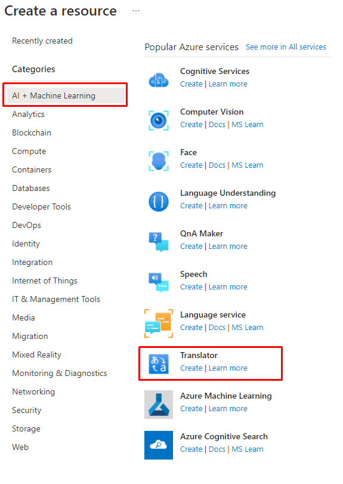
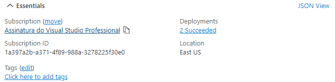
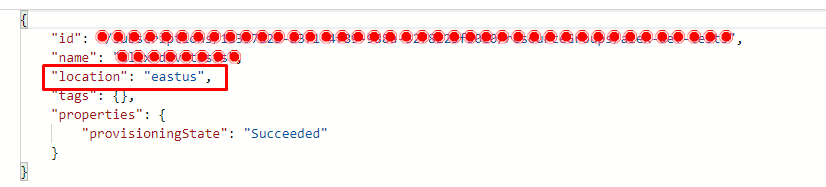
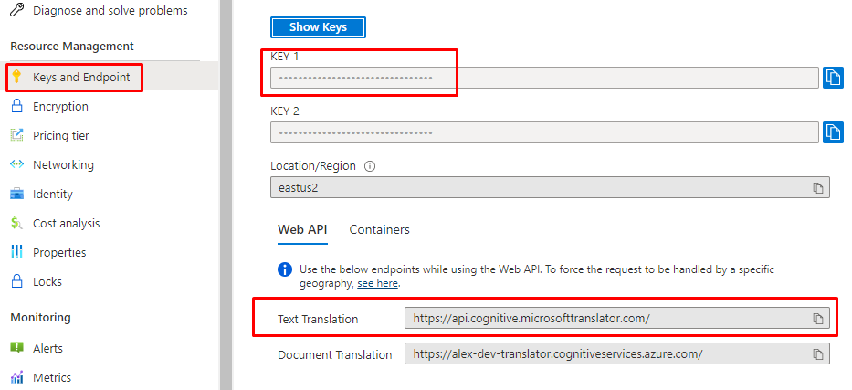
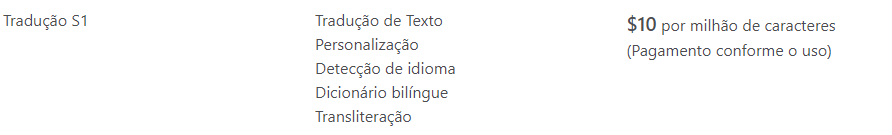
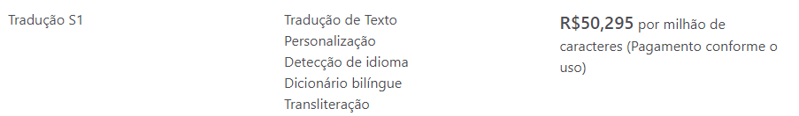

## POC Translations
This project is a Prove of Concept to show how can we use Translation Service of Azure Cognitive Service to translate some text.

### Provision the service ☁
That is very simple to create. Just into our resource and click to create a Translation Service, like this:



Then we just need to inform the Subscription, Region, and Name of our service.

### Show me the code! 👨‍💻

First we need to get all the necessary credentials:

#### Configure the credentials

First let's get the region information. For it, you can go on the Service Overview and get to show the JSON View:



And then, we get the location field:



Next we need the key, and URL:



#### In the project

First, let's define the fields that we will use, in "appsettings.json" file:

```json
{
  "TextTranslationHttpClientOptions": {
    "BaseAddress": "https://api.cognitive.microsofttranslator.com",
    "TranslateEndpoint": "/translate",
    "Key": "<YOUR-KEY>",
    "Region": "eastus2",
    "ApiVersion": "3.0",
    "From": "pt",
    "To": [ "en" ]
  }
}
```

Then we need just configure the HttpClient to consume this service. For it, we can just inject this dependency like this:

```csharp
...

services
    .AddHttpClient<ITranslationHttpClient, TranslationHttpClient>()
    .ConfigureHttpClient((provider, client) =>
    {
        var options = provider.GetRequiredService<IOptions<TextTranslationHttpClientOptions>>().Value;

        client.BaseAddress = new(options.BaseAddress);
        client.DefaultRequestHeaders.Add("Ocp-Apim-Subscription-Key", options.Key);
        client.DefaultRequestHeaders.Add("Ocp-Apim-Subscription-Region", options.Region);
    });

...

And use it!


```

### Costs





---

#### References
* https://docs.microsoft.com/en-us/azure/cognitive-services/translator/quickstart-translator?tabs=csharp
* https://azure.microsoft.com/pt-br/pricing/details/cognitive-services/